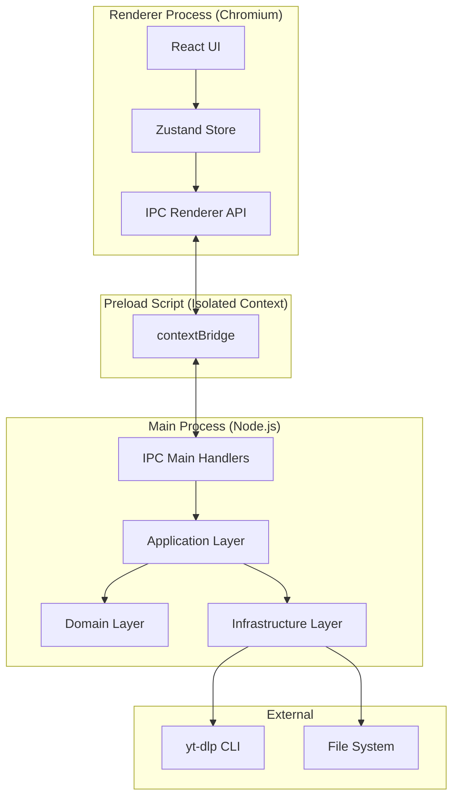
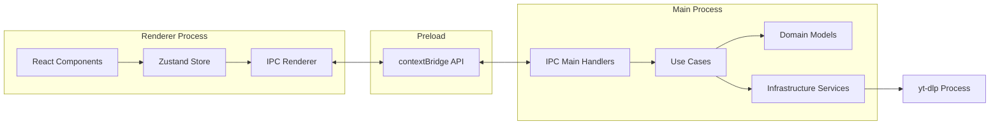
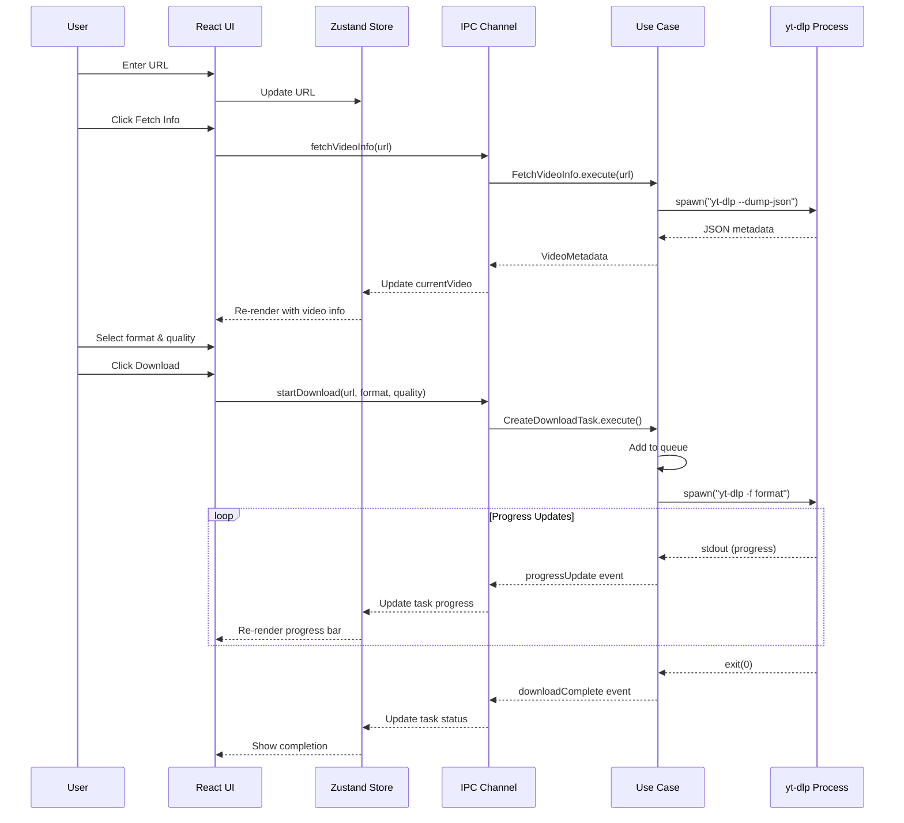
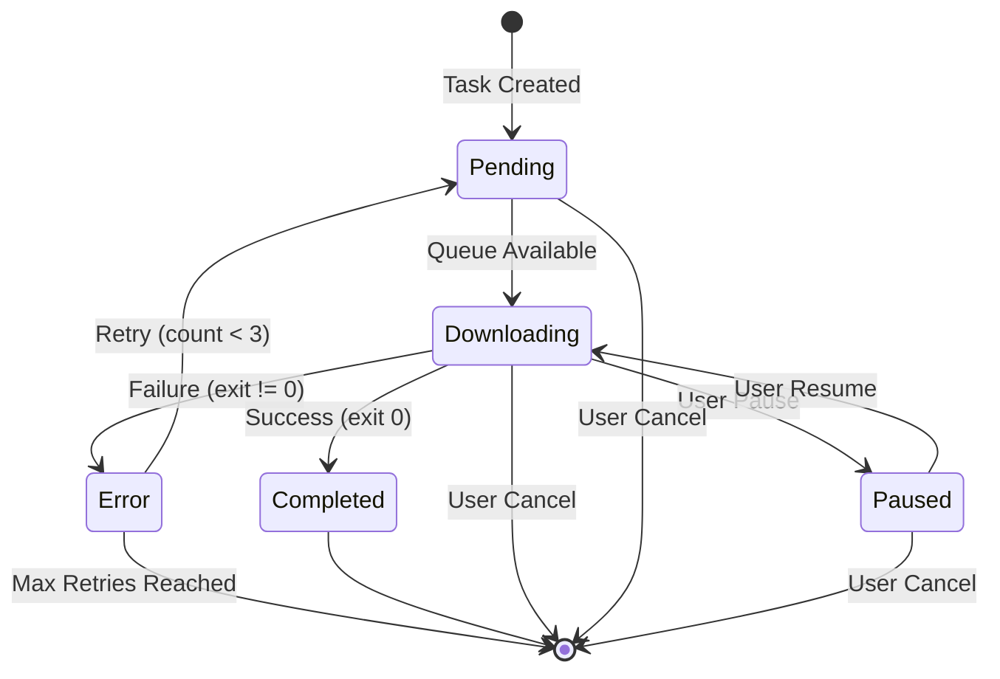
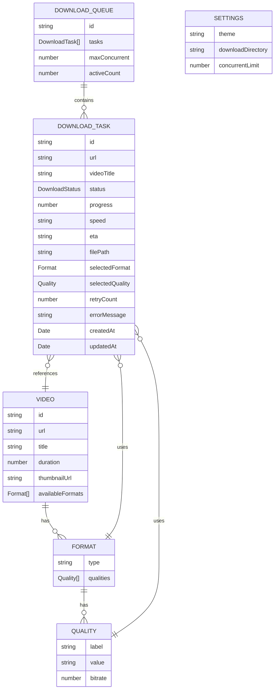

# Design Document - Ytomp34

## Overview

Ytomp34 is a cross-platform desktop application built with Electron.js that provides a user-friendly interface for downloading videos and audio from online sources using yt-dlp. The application implements Clean Architecture principles with strict separation between Domain, Application, Infrastructure, and Presentation layers.

### Core Capabilities

- **URL-based video downloading**: Support for YouTube, Vimeo, and 1000+ yt-dlp-compatible platforms
- **Format flexibility**: MP4 (video) and MP3 (audio) with quality selection
- **Queue management**: FIFO queue with configurable concurrent download limits (1-10, default 3)
- **Progress tracking**: Real-time progress percentage, speed, and ETA display
- **Download control**: Pause, resume, cancel, and automatic retry (up to 3 attempts)
- **Persistent settings**: Theme (light/dark) and download directory preferences
- **Security-first IPC**: Context isolation with validated message contracts

### Technology Stack

- **Runtime**: Electron.js (main + renderer processes)
- **UI Framework**: React 18+ with TailwindCSS
- **State Management**: Zustand (chosen for simplicity and low boilerplate)
- **Icons**: lucide-react (no emoji)
- **External Tool**: yt-dlp (command-line video downloader)
- **Build System**: electron-builder (NSIS installer + portable executable)
- **Language**: TypeScript for type safety

### Design Principles

1. **Clean Architecture**: Domain → Application → Infrastructure → Presentation
2. **Contract-First Development**: Define entities and IPC contracts before implementation
3. **Security by Default**: contextIsolation=true, nodeIntegration=false, input validation
4. **Fail-Safe Operation**: Graceful error handling, no crashes
5. **Future Extensibility**: Support for playlists, subtitles, and plugins

## Architecture

### High-Level Architecture

The application follows Clean Architecture with four distinct layers:

```
┌─────────────────────────────────────────────────────────────┐
│                    Presentation Layer                        │
│              (React UI - Renderer Process)                   │
│  Components: URLInput, VideoInfo, FormatSelector,           │
│              DownloadQueue, DownloadItem, Settings           │
└────────────────────┬────────────────────────────────────────┘
                     │ IPC (contextBridge)
┌────────────────────┴────────────────────────────────────────┐
│                   Application Layer                          │
│                  (Use Cases - Main Process)                  │
│  Use Cases: FetchVideoInfo, CreateDownloadTask,             │
│             ExecuteDownload, ManageQueue, UpdateSettings     │
└────────────────────┬────────────────────────────────────────┘
                     │ Dependency Injection
┌────────────────────┴────────────────────────────────────────┐
│                    Domain Layer                              │
│                   (Pure Entities)                            │
│  Entities: Video, DownloadTask, Settings, Queue              │
│  Value Objects: DownloadStatus, Format, Quality             │
└──────────────────────────────────────────────────────────────┘
                     │
┌────────────────────┴────────────────────────────────────────┐
│                 Infrastructure Layer                         │
│              (External Dependencies)                         │
│  Services: YtDlpExecutor, FileSystem, SettingsStore,        │
│            ProgressParser, FileSanitizer, Logger             │
└──────────────────────────────────────────────────────────────┘
```

### Process Architecture



### Component Diagram



### Data Flow Diagram



### Download Task State Machine



### Entity Relationship Diagram



## Components and Interfaces

### Domain Entities

#### Video Entity

```typescript
interface Video {
  readonly id: string;
  readonly url: string;
  readonly title: string;
  readonly duration: number; // seconds
  readonly thumbnailUrl: string;
  readonly availableFormats: Format[];
}

interface Format {
  readonly type: 'mp4' | 'mp3';
  readonly qualities: Quality[];
}

interface Quality {
  readonly label: string; // "1080p", "720p", "320kbps"
  readonly value: string; // format code for yt-dlp
  readonly bitrate?: number; // for audio
  readonly resolution?: string; // for video
}
```

#### DownloadTask Entity

```typescript
type DownloadStatus = 
  | 'pending' 
  | 'downloading' 
  | 'paused' 
  | 'completed' 
  | 'error';

interface DownloadTask {
  readonly id: string;
  readonly url: string;
  readonly videoTitle: string;
  status: DownloadStatus;
  progress: number; // 0-100
  speed: string; // "1.5MiB/s"
  eta: string; // "00:05:23"
  readonly filePath: string;
  readonly selectedFormat: 'mp4' | 'mp3';
  readonly selectedQuality: string;
  retryCount: number;
  errorMessage?: string;
  readonly createdAt: Date;
  updatedAt: Date;
  processId?: number; // for pause/resume/cancel
}
```

#### Settings Entity

```typescript
interface Settings {
  theme: 'light' | 'dark';
  downloadDirectory: string;
  concurrentLimit: number; // 1-10, default 3
}
```

#### DownloadQueue Entity

```typescript
interface DownloadQueue {
  readonly id: string;
  tasks: DownloadTask[];
  readonly maxConcurrent: number;
  
  // Methods
  addTask(task: DownloadTask): void;
  removeTask(taskId: string): void;
  getNextPendingTask(): DownloadTask | null;
  getActiveTasksCount(): number;
  canStartNewTask(): boolean;
}
```

### IPC Contracts

All IPC communication follows a strict request/response pattern with validation.

#### Video Information Contract

```typescript
// Request
interface FetchVideoInfoRequest {
  url: string;
}

// Response
interface FetchVideoInfoResponse {
  success: boolean;
  data?: Video;
  error?: {
    type: 'invalid_url' | 'yt_dlp_missing' | 'network_error' | 'unknown';
    message: string;
  };
}

// Channel: 'video:fetch-info'
```

#### Download Management Contracts

```typescript
// Start Download
interface StartDownloadRequest {
  url: string;
  format: 'mp4' | 'mp3';
  quality: string;
}

interface StartDownloadResponse {
  success: boolean;
  taskId?: string;
  error?: {
    type: 'invalid_params' | 'queue_full' | 'unknown';
    message: string;
  };
}
// Channel: 'download:start'

// Pause Download
interface PauseDownloadRequest {
  taskId: string;
}

interface PauseDownloadResponse {
  success: boolean;
  error?: string;
}
// Channel: 'download:pause'

// Resume Download
interface ResumeDownloadRequest {
  taskId: string;
}

interface ResumeDownloadResponse {
  success: boolean;
  error?: string;
}
// Channel: 'download:resume'

// Cancel Download
interface CancelDownloadRequest {
  taskId: string;
}

interface CancelDownloadResponse {
  success: boolean;
  error?: string;
}
// Channel: 'download:cancel'

// Progress Event (Main → Renderer)
interface ProgressUpdateEvent {
  taskId: string;
  progress: number;
  speed: string;
  eta: string;
  status: DownloadStatus;
}
// Channel: 'download:progress'

// Queue State Event (Main → Renderer)
interface QueueStateEvent {
  tasks: DownloadTask[];
}
// Channel: 'download:queue-update'
```

#### Settings Contracts

```typescript
// Get Settings
interface GetSettingsRequest {}

interface GetSettingsResponse {
  success: boolean;
  data?: Settings;
}
// Channel: 'settings:get'

// Update Settings
interface UpdateSettingsRequest {
  theme?: 'light' | 'dark';
  downloadDirectory?: string;
  concurrentLimit?: number;
}

interface UpdateSettingsResponse {
  success: boolean;
  data?: Settings;
  error?: string;
}
// Channel: 'settings:update'

// Select Folder
interface SelectFolderRequest {}

interface SelectFolderResponse {
  success: boolean;
  path?: string;
  cancelled: boolean;
}
// Channel: 'settings:select-folder'
```

### Infrastructure Service Interfaces

#### YtDlpExecutor Interface

```typescript
interface YtDlpExecutor {
  /**
   * Check if yt-dlp is installed and accessible
   */
  checkInstallation(): Promise<{ installed: boolean; version?: string }>;
  
  /**
   * Fetch video metadata using --dump-json
   */
  fetchMetadata(url: string): Promise<Video>;
  
  /**
   * Start download process
   * Returns process ID for control operations
   */
  startDownload(
    url: string,
    format: string,
    quality: string,
    outputPath: string,
    onProgress: (progress: ProgressData) => void,
    onError: (error: string) => void,
    onComplete: () => void
  ): Promise<number>; // returns PID
  
  /**
   * Pause download process
   */
  pauseProcess(pid: number): Promise<void>;
  
  /**
   * Resume download process
   */
  resumeProcess(pid: number): Promise<void>;
  
  /**
   * Cancel download process
   */
  cancelProcess(pid: number): Promise<void>;
}

interface ProgressData {
  percentage: number;
  speed: string;
  eta: string;
}
```

#### ProgressParser Interface

```typescript
interface ProgressParser {
  /**
   * Parse yt-dlp stdout line and extract progress information
   * Returns null if line doesn't contain progress data
   */
  parse(line: string): ProgressData | null;
}
```

#### FileSanitizer Interface

```typescript
interface FileSanitizer {
  /**
   * Remove invalid characters from filename
   * Limit length to 200 characters
   * Handle empty results with default name
   */
  sanitize(filename: string): string;
  
  /**
   * Check if file exists and append numeric suffix if needed
   * Returns final unique filename
   */
  ensureUnique(directory: string, filename: string, extension: string): string;
}
```

#### SettingsStore Interface

```typescript
interface SettingsStore {
  /**
   * Load settings from disk
   * Create default settings if file doesn't exist
   */
  load(): Promise<Settings>;
  
  /**
   * Save settings to disk
   */
  save(settings: Settings): Promise<void>;
  
  /**
   * Validate settings values
   */
  validate(settings: Partial<Settings>): { valid: boolean; errors: string[] };
}
```

#### Logger Interface

```typescript
type LogLevel = 'info' | 'error' | 'debug';

interface Logger {
  info(message: string, meta?: Record<string, any>): void;
  error(message: string, error?: Error, meta?: Record<string, any>): void;
  debug(message: string, meta?: Record<string, any>): void;
}
```

### Use Case Implementations

#### FetchVideoInfo Use Case

```typescript
class FetchVideoInfoUseCase {
  constructor(
    private ytDlpExecutor: YtDlpExecutor,
    private logger: Logger
  ) {}
  
  async execute(url: string): Promise<FetchVideoInfoResponse> {
    try {
      // Validate URL format
      if (!this.isValidUrl(url)) {
        return {
          success: false,
          error: {
            type: 'invalid_url',
            message: 'Invalid URL format'
          }
        };
      }
      
      // Check yt-dlp installation
      const { installed } = await this.ytDlpExecutor.checkInstallation();
      if (!installed) {
        return {
          success: false,
          error: {
            type: 'yt_dlp_missing',
            message: 'yt-dlp is not installed. Please install it from https://github.com/yt-dlp/yt-dlp'
          }
        };
      }
      
      // Fetch metadata with timeout
      const video = await Promise.race([
        this.ytDlpExecutor.fetchMetadata(url),
        this.timeout(10000)
      ]);
      
      this.logger.info('Video metadata fetched', { videoId: video.id });
      
      return {
        success: true,
        data: video
      };
    } catch (error) {
      this.logger.error('Failed to fetch video info', error as Error, { url });
      
      return {
        success: false,
        error: {
          type: this.categorizeError(error),
          message: (error as Error).message
        }
      };
    }
  }
  
  private isValidUrl(url: string): boolean {
    try {
      new URL(url);
      return true;
    } catch {
      return false;
    }
  }
  
  private timeout(ms: number): Promise<never> {
    return new Promise((_, reject) => 
      setTimeout(() => reject(new Error('Timeout')), ms)
    );
  }
  
  private categorizeError(error: any): 'network_error' | 'unknown' {
    if (error.message?.includes('network') || error.message?.includes('ENOTFOUND')) {
      return 'network_error';
    }
    return 'unknown';
  }
}
```

#### CreateDownloadTask Use Case

```typescript
class CreateDownloadTaskUseCase {
  constructor(
    private queue: DownloadQueue,
    private fileSanitizer: FileSanitizer,
    private settingsStore: SettingsStore,
    private logger: Logger
  ) {}
  
  async execute(
    url: string,
    videoTitle: string,
    format: 'mp4' | 'mp3',
    quality: string
  ): Promise<StartDownloadResponse> {
    try {
      // Load settings to get download directory
      const settings = await this.settingsStore.load();
      
      // Sanitize filename
      const sanitizedTitle = this.fileSanitizer.sanitize(videoTitle);
      const extension = format === 'mp4' ? '.mp4' : '.mp3';
      const uniqueFilename = this.fileSanitizer.ensureUnique(
        settings.downloadDirectory,
        sanitizedTitle,
        extension
      );
      
      // Create download task
      const task: DownloadTask = {
        id: this.generateId(),
        url,
        videoTitle,
        status: 'pending',
        progress: 0,
        speed: '0 B/s',
        eta: '--:--:--',
        filePath: path.join(settings.downloadDirectory, uniqueFilename),
        selectedFormat: format,
        selectedQuality: quality,
        retryCount: 0,
        createdAt: new Date(),
        updatedAt: new Date()
      };
      
      // Add to queue
      this.queue.addTask(task);
      
      this.logger.info('Download task created', { taskId: task.id });
      
      return {
        success: true,
        taskId: task.id
      };
    } catch (error) {
      this.logger.error('Failed to create download task', error as Error);
      
      return {
        success: false,
        error: {
          type: 'unknown',
          message: (error as Error).message
        }
      };
    }
  }
  
  private generateId(): string {
    return `task_${Date.now()}_${Math.random().toString(36).substr(2, 9)}`;
  }
}
```

#### ExecuteDownload Use Case

```typescript
class ExecuteDownloadUseCase {
  constructor(
    private ytDlpExecutor: YtDlpExecutor,
    private queue: DownloadQueue,
    private logger: Logger,
    private onProgressUpdate: (taskId: string, progress: ProgressData) => void,
    private onStatusChange: (taskId: string, status: DownloadStatus) => void
  ) {}
  
  async execute(task: DownloadTask): Promise<void> {
    try {
      // Update status to downloading
      task.status = 'downloading';
      task.updatedAt = new Date();
      this.onStatusChange(task.id, 'downloading');
      
      // Start download
      const pid = await this.ytDlpExecutor.startDownload(
        task.url,
        task.selectedFormat,
        task.selectedQuality,
        task.filePath,
        // Progress callback
        (progress) => {
          task.progress = progress.percentage;
          task.speed = progress.speed;
          task.eta = progress.eta;
          task.updatedAt = new Date();
          this.onProgressUpdate(task.id, progress);
        },
        // Error callback
        (error) => {
          this.handleDownloadError(task, error);
        },
        // Complete callback
        () => {
          this.handleDownloadComplete(task);
        }
      );
      
      // Store PID for pause/resume/cancel
      task.processId = pid;
      
      this.logger.info('Download started', { taskId: task.id, pid });
    } catch (error) {
      this.logger.error('Failed to execute download', error as Error, { taskId: task.id });
      this.handleDownloadError(task, (error as Error).message);
    }
  }
  
  private handleDownloadComplete(task: DownloadTask): void {
    task.status = 'completed';
    task.progress = 100;
    task.updatedAt = new Date();
    this.onStatusChange(task.id, 'completed');
    
    this.logger.info('Download completed', { taskId: task.id });
    
    // Start next task in queue
    this.startNextTask();
  }
  
  private handleDownloadError(task: DownloadTask, error: string): void {
    task.errorMessage = error;
    task.updatedAt = new Date();
    
    // Check if should retry
    if (task.retryCount < 3) {
      task.retryCount++;
      task.status = 'pending';
      this.logger.info('Retrying download', { taskId: task.id, retryCount: task.retryCount });
      
      // Add delay for network errors
      if (this.isNetworkError(error)) {
        setTimeout(() => this.startNextTask(), 5000);
      } else {
        this.startNextTask();
      }
    } else {
      task.status = 'error';
      this.onStatusChange(task.id, 'error');
      this.logger.error('Download failed after max retries', undefined, { taskId: task.id });
      this.startNextTask();
    }
  }
  
  private isNetworkError(error: string): boolean {
    return error.toLowerCase().includes('network') || 
           error.toLowerCase().includes('connection') ||
           error.toLowerCase().includes('timeout');
  }
  
  private startNextTask(): void {
    if (this.queue.canStartNewTask()) {
      const nextTask = this.queue.getNextPendingTask();
      if (nextTask) {
        this.execute(nextTask);
      }
    }
  }
}
```

## Data Models

### Type Definitions

```typescript
// Domain Types
export type DownloadStatus = 'pending' | 'downloading' | 'paused' | 'completed' | 'error';
export type FormatType = 'mp4' | 'mp3';
export type Theme = 'light' | 'dark';
export type ErrorType = 'invalid_url' | 'yt_dlp_missing' | 'network_error' | 'permission_error' | 'unknown';

// Value Objects
export interface Quality {
  readonly label: string;
  readonly value: string;
  readonly bitrate?: number;
  readonly resolution?: string;
}

export interface Format {
  readonly type: FormatType;
  readonly qualities: Quality[];
}

// Entities (as defined above)
export interface Video { /* ... */ }
export interface DownloadTask { /* ... */ }
export interface Settings { /* ... */ }
export interface DownloadQueue { /* ... */ }

// IPC Contracts (as defined above)
export interface FetchVideoInfoRequest { /* ... */ }
export interface FetchVideoInfoResponse { /* ... */ }
// ... etc
```

### Serialization/Deserialization

```typescript
// DownloadTask Parser
class DownloadTaskParser {
  static toJSON(task: DownloadTask): string {
    return JSON.stringify({
      id: task.id,
      url: task.url,
      videoTitle: task.videoTitle,
      status: task.status,
      progress: task.progress,
      speed: task.speed,
      eta: task.eta,
      filePath: task.filePath,
      selectedFormat: task.selectedFormat,
      selectedQuality: task.selectedQuality,
      retryCount: task.retryCount,
      errorMessage: task.errorMessage,
      createdAt: task.createdAt.toISOString(),
      updatedAt: task.updatedAt.toISOString(),
      processId: task.processId
    }, null, 2);
  }
  
  static fromJSON(json: string): DownloadTask {
    const obj = JSON.parse(json);
    return {
      ...obj,
      createdAt: new Date(obj.createdAt),
      updatedAt: new Date(obj.updatedAt)
    };
  }
}

// Queue Persistence
class QueuePersistence {
  constructor(private filePath: string) {}
  
  async save(queue: DownloadQueue): Promise<void> {
    const data = {
      id: queue.id,
      maxConcurrent: queue.maxConcurrent,
      tasks: queue.tasks.map(task => JSON.parse(DownloadTaskParser.toJSON(task)))
    };
    await fs.promises.writeFile(this.filePath, JSON.stringify(data, null, 2));
  }
  
  async load(): Promise<DownloadQueue | null> {
    try {
      const data = await fs.promises.readFile(this.filePath, 'utf-8');
      const obj = JSON.parse(data);
      return {
        id: obj.id,
        maxConcurrent: obj.maxConcurrent,
        tasks: obj.tasks.map((t: any) => DownloadTaskParser.fromJSON(JSON.stringify(t))),
        addTask: function(task) { this.tasks.push(task); },
        removeTask: function(taskId) { 
          this.tasks = this.tasks.filter(t => t.id !== taskId); 
        },
        getNextPendingTask: function() {
          return this.tasks.find(t => t.status === 'pending') || null;
        },
        getActiveTasksCount: function() {
          return this.tasks.filter(t => t.status === 'downloading').length;
        },
        canStartNewTask: function() {
          return this.getActiveTasksCount() < this.maxConcurrent;
        }
      };
    } catch {
      return null;
    }
  }
}
```

## Correctness Properties

*A property is a characteristic or behavior that should hold true across all valid executions of a system—essentially, a formal statement about what the system should do. Properties serve as the bridge between human-readable specifications and machine-verifiable correctness guarantees.*

### Property 1: URL Validation Correctness

*For any* string input, the URL validator SHALL return true if and only if the string is a valid URL according to the URL specification, and false otherwise.

**Validates: Requirements 1.1**

### Property 2: Video Metadata Parsing Completeness

*For any* valid yt-dlp JSON output, the metadata parser SHALL extract all required fields (title, duration, thumbnailUrl, availableFormats) and produce a valid Video entity.

**Validates: Requirements 2.2**

### Property 3: Default Quality Selection

*For any* list of available qualities for a selected format, the Format_Selector SHALL default to the quality with the highest bitrate (for audio) or resolution (for video).

**Validates: Requirements 3.4**

### Property 4: Download Task Creation Integrity

*For any* valid URL, format, and quality combination, creating a download task SHALL produce a DownloadTask entity with a unique ID, status "pending", progress 0, and all input parameters correctly stored.

**Validates: Requirements 4.1, 4.2, 4.5**

### Property 5: Filename Sanitization Safety

*For any* string input, the File_Sanitizer SHALL produce a filename that: (1) contains no invalid filesystem characters (< > : " / \ | ? *), (2) has leading and trailing whitespace removed, (3) is at most 200 characters long, and (4) is non-empty (using "download" as fallback if needed).

**Validates: Requirements 4.3, 20.1, 20.2, 20.3, 20.4, 20.5**

### Property 6: Unique Filename Generation

*For any* filename and directory, if a file with that name already exists, the File_Sanitizer SHALL append a numeric suffix (e.g., " (1)", " (2)") to produce a unique filename that does not exist in the directory.

**Validates: Requirements 4.4**

### Property 7: Process Spawn Parameter Correctness

*For any* format and quality selection, spawning a yt-dlp download process SHALL include the correct format code and quality parameters in the command-line arguments.

**Validates: Requirements 5.3**

### Property 8: Progress Parsing Robustness

*For any* yt-dlp stdout line, the Progress_Parser SHALL either extract valid progress data (percentage 0-100, speed string, ETA string) or return the last known values (or defaults: 0, "0 B/s", "--:--:--") if parsing fails.

**Validates: Requirements 6.1, 6.2, 6.3**

### Property 9: FIFO Queue Ordering

*For any* sequence of download tasks added to the queue, the tasks SHALL be processed in the exact order they were added (first-in-first-out).

**Validates: Requirements 7.1**

### Property 10: Concurrent Download Limit Enforcement

*For any* configured concurrent download limit (1-10), the number of tasks with status "downloading" SHALL never exceed the configured limit.

**Validates: Requirements 7.2, 21.2, 21.4**

### Property 11: State Machine Transition Validity

*For any* download task, all status transitions SHALL follow the valid state machine paths: pending→downloading, downloading→paused, paused→downloading, downloading→completed, downloading→error, error→pending (if retryCount < 3).

**Validates: Requirements 7.4**

### Property 12: Queue Task Removal

*For any* task in the queue, removing it by ID SHALL result in the task no longer being present in the queue, and the queue length decreasing by 1.

**Validates: Requirements 9.3**

### Property 13: Retry Logic with Counter

*For any* download task that fails with retryCount < 3, the task SHALL have its retryCount incremented by 1 and status changed to "pending". For tasks with retryCount >= 3, the status SHALL remain "error" and no retry SHALL occur.

**Validates: Requirements 10.2, 10.4**

### Property 14: Settings Validation and Range Enforcement

*For any* settings update request, the validator SHALL: (1) accept theme values only from {"light", "dark"}, (2) accept concurrentLimit values only from [1, 10], and (3) accept downloadDirectory values only if the path is writable.

**Validates: Requirements 11.4, 21.2, 21.3**

### Property 15: Error Logging Completeness

*For any* error that occurs in the application, the logger SHALL create a log entry containing: (1) timestamp, (2) log level "error", (3) error message, and (4) stack trace (if available).

**Validates: Requirements 14.1, 15.3**

### Property 16: Error Categorization Accuracy

*For any* error, the application SHALL categorize it into exactly one of: "yt_dlp_missing", "invalid_url", "network_error", "permission_error", or "unknown", based on the error message and context.

**Validates: Requirements 14.2**

### Property 17: Error Resilience (No Crash)

*For any* error that occurs during any operation (URL validation, metadata fetching, download execution, settings update), the application SHALL handle the error gracefully, log it, and continue running without crashing.

**Validates: Requirements 14.5**

### Property 18: IPC Message Validation

*For any* IPC message received from the renderer process, the main process SHALL validate the message structure and types before processing, rejecting messages that do not match the expected contract.

**Validates: Requirements 16.3, 16.5**

### Property 19: State Update from IPC Events

*For any* valid IPC event received by the renderer, the Zustand store SHALL update the corresponding state (currentVideo, downloadQueue, or settings) to reflect the event data.

**Validates: Requirements 17.3**

### Property 20: Serialization Round-Trip Equivalence

*For any* valid DownloadTask object, serializing it to JSON using the pretty printer and then deserializing it using the parser SHALL produce an equivalent DownloadTask object (with all fields matching).

**Validates: Requirements 24.5**

<function_calls>
<invoke name="prework">
<parameter name="featureName">ytomp34


## Error Handling

### Error Categories

The application categorizes all errors into five types for consistent handling and user communication:

1. **yt_dlp_missing**: yt-dlp is not installed or not found in PATH
2. **invalid_url**: URL format is invalid or not supported
3. **network_error**: Network connectivity issues, timeouts, DNS failures
4. **permission_error**: File system permission denied, directory not writable
5. **unknown**: All other errors not matching above categories

### Error Handling Strategy

#### Layered Error Handling

```typescript
// Infrastructure Layer: Throw specific errors
class YtDlpNotFoundError extends Error {
  constructor() {
    super('yt-dlp is not installed');
    this.name = 'YtDlpNotFoundError';
  }
}

// Application Layer: Catch and categorize
class ErrorCategorizer {
  categorize(error: Error): ErrorType {
    if (error instanceof YtDlpNotFoundError) return 'yt_dlp_missing';
    if (error.message.includes('Invalid URL')) return 'invalid_url';
    if (error.message.match(/network|ENOTFOUND|ETIMEDOUT/i)) return 'network_error';
    if (error.message.match(/EACCES|EPERM/i)) return 'permission_error';
    return 'unknown';
  }
}

// Presentation Layer: Display user-friendly messages
const ERROR_MESSAGES: Record<ErrorType, string> = {
  yt_dlp_missing: 'yt-dlp is not installed. Please install it from https://github.com/yt-dlp/yt-dlp',
  invalid_url: 'The URL you entered is not valid. Please check and try again.',
  network_error: 'Network error occurred. Please check your internet connection and try again.',
  permission_error: 'Permission denied. Please check folder permissions or choose a different location.',
  unknown: 'An unexpected error occurred. Please try again or check the logs for details.'
};
```

#### Error Recovery Strategies

| Error Type | Recovery Strategy |
|------------|-------------------|
| yt_dlp_missing | Display installation instructions, allow app to continue |
| invalid_url | Show error message, clear input, allow retry |
| network_error | Automatic retry (up to 3 times with 5s delay) |
| permission_error | Fallback to default Downloads directory, show warning |
| unknown | Log error, show generic message, continue operation |

#### Logging Strategy

All errors are logged with structured information:

```typescript
interface ErrorLogEntry {
  timestamp: string;
  level: 'error';
  errorType: ErrorType;
  message: string;
  stackTrace?: string;
  context: {
    operation: string; // e.g., "fetchVideoInfo", "startDownload"
    taskId?: string;
    url?: string;
    [key: string]: any;
  };
}
```

#### Graceful Degradation

The application implements fail-safe patterns:

1. **Missing yt-dlp**: App starts with warning, allows settings configuration
2. **Invalid download directory**: Falls back to system Downloads folder
3. **Failed metadata fetch**: Shows error, allows retry without restarting app
4. **Download failure**: Automatic retry up to 3 times, then marks as error
5. **IPC validation failure**: Rejects message, logs error, continues operation

#### User Feedback

Error messages follow these principles:

1. **Clear**: Explain what went wrong in simple terms
2. **Actionable**: Provide specific steps to resolve the issue
3. **Non-technical**: Avoid jargon and technical details
4. **Helpful**: Include links or instructions where applicable

Example error display:

```typescript
interface ErrorDisplay {
  title: string;
  message: string;
  action?: {
    label: string;
    link?: string;
    onClick?: () => void;
  };
}

const YT_DLP_MISSING_ERROR: ErrorDisplay = {
  title: 'yt-dlp Not Found',
  message: 'yt-dlp is required to download videos. Please install it to continue.',
  action: {
    label: 'Installation Guide',
    link: 'https://github.com/yt-dlp/yt-dlp#installation'
  }
};
```

## Testing Strategy

### Testing Approach

The application uses a dual testing approach combining property-based testing and example-based testing:

#### Property-Based Testing (PBT)

Property-based tests verify universal properties across many generated inputs. The application uses **fast-check** (for TypeScript/JavaScript) as the PBT library.

**Configuration:**
- Minimum 100 iterations per property test
- Each test tagged with feature name and property number
- Tag format: `Feature: ytomp34, Property {N}: {property description}`

**Property Test Examples:**

```typescript
import fc from 'fast-check';

// Property 1: URL Validation Correctness
describe('Feature: ytomp34, Property 1: URL Validation Correctness', () => {
  it('should validate URLs correctly', () => {
    fc.assert(
      fc.property(
        fc.webUrl(), // generates valid URLs
        (url) => {
          const result = validateUrl(url);
          expect(result).toBe(true);
        }
      ),
      { numRuns: 100 }
    );
    
    fc.assert(
      fc.property(
        fc.string().filter(s => {
          try { new URL(s); return false; } catch { return true; }
        }), // generates invalid URLs
        (invalidUrl) => {
          const result = validateUrl(invalidUrl);
          expect(result).toBe(false);
        }
      ),
      { numRuns: 100 }
    );
  });
});

// Property 5: Filename Sanitization Safety
describe('Feature: ytomp34, Property 5: Filename Sanitization Safety', () => {
  it('should sanitize filenames safely', () => {
    fc.assert(
      fc.property(
        fc.string(), // any string
        (input) => {
          const sanitized = fileSanitizer.sanitize(input);
          
          // No invalid characters
          expect(sanitized).not.toMatch(/[<>:"/\\|?*]/);
          
          // No leading/trailing whitespace
          expect(sanitized).toBe(sanitized.trim());
          
          // Length <= 200
          expect(sanitized.length).toBeLessThanOrEqual(200);
          
          // Non-empty (uses "download" as fallback)
          expect(sanitized.length).toBeGreaterThan(0);
        }
      ),
      { numRuns: 100 }
    );
  });
});

// Property 20: Serialization Round-Trip Equivalence
describe('Feature: ytomp34, Property 20: Serialization Round-Trip Equivalence', () => {
  it('should preserve task data through serialization round-trip', () => {
    fc.assert(
      fc.property(
        fc.record({
          id: fc.string(),
          url: fc.webUrl(),
          videoTitle: fc.string(),
          status: fc.constantFrom('pending', 'downloading', 'paused', 'completed', 'error'),
          progress: fc.integer({ min: 0, max: 100 }),
          speed: fc.string(),
          eta: fc.string(),
          filePath: fc.string(),
          selectedFormat: fc.constantFrom('mp4', 'mp3'),
          selectedQuality: fc.string(),
          retryCount: fc.integer({ min: 0, max: 3 }),
          createdAt: fc.date(),
          updatedAt: fc.date()
        }),
        (task) => {
          const json = DownloadTaskParser.toJSON(task);
          const parsed = DownloadTaskParser.fromJSON(json);
          
          expect(parsed).toEqual(task);
        }
      ),
      { numRuns: 100 }
    );
  });
});
```

#### Example-Based Unit Testing

Example-based tests verify specific scenarios, edge cases, and integration points:

```typescript
// URL Input and Validation
describe('URL Input', () => {
  it('should display error for invalid URL', () => {
    const result = validateUrl('not-a-url');
    expect(result).toBe(false);
  });
  
  it('should enable fetch button for valid URL', () => {
    const result = validateUrl('https://www.youtube.com/watch?v=dQw4w9WgXcQ');
    expect(result).toBe(true);
  });
});

// Download State Machine
describe('Download State Machine', () => {
  it('should transition from pending to downloading', () => {
    const task = createTask({ status: 'pending' });
    task.status = 'downloading';
    expect(task.status).toBe('downloading');
  });
  
  it('should transition from downloading to paused', () => {
    const task = createTask({ status: 'downloading' });
    task.status = 'paused';
    expect(task.status).toBe('paused');
  });
  
  it('should not retry after 3 failures', () => {
    const task = createTask({ status: 'error', retryCount: 3 });
    const shouldRetry = task.retryCount < 3;
    expect(shouldRetry).toBe(false);
  });
});

// Settings Management
describe('Settings', () => {
  it('should create default settings if file does not exist', async () => {
    const settings = await settingsStore.load();
    expect(settings.theme).toBe('light');
    expect(settings.concurrentLimit).toBe(3);
  });
  
  it('should reject invalid theme value', () => {
    const result = settingsStore.validate({ theme: 'blue' as any });
    expect(result.valid).toBe(false);
  });
});
```

#### Integration Testing

Integration tests verify external dependencies and end-to-end flows:

```typescript
// yt-dlp Integration
describe('yt-dlp Integration', () => {
  it('should fetch metadata for valid YouTube URL', async () => {
    const video = await ytDlpExecutor.fetchMetadata('https://www.youtube.com/watch?v=dQw4w9WgXcQ');
    expect(video.title).toBeDefined();
    expect(video.duration).toBeGreaterThan(0);
  });
  
  it('should handle network errors gracefully', async () => {
    // Mock network failure
    await expect(
      ytDlpExecutor.fetchMetadata('https://invalid-domain-12345.com/video')
    ).rejects.toThrow('network');
  });
});

// File System Integration
describe('File System', () => {
  it('should create unique filename when file exists', () => {
    fs.writeFileSync('/tmp/test.mp4', '');
    const unique = fileSanitizer.ensureUnique('/tmp', 'test', '.mp4');
    expect(unique).toBe('test (1).mp4');
  });
});

// IPC Integration
describe('IPC Communication', () => {
  it('should send progress updates from main to renderer', (done) => {
    ipcRenderer.on('download:progress', (event, data) => {
      expect(data.taskId).toBeDefined();
      expect(data.progress).toBeGreaterThanOrEqual(0);
      done();
    });
    
    // Trigger download in main process
    ipcRenderer.send('download:start', { url: 'test', format: 'mp4', quality: '720p' });
  });
});
```

#### Mocking Strategy

External dependencies are mocked for unit and property tests:

```typescript
// Mock yt-dlp executor
class MockYtDlpExecutor implements YtDlpExecutor {
  async checkInstallation() {
    return { installed: true, version: '2024.01.01' };
  }
  
  async fetchMetadata(url: string): Promise<Video> {
    return {
      id: 'mock-id',
      url,
      title: 'Mock Video',
      duration: 180,
      thumbnailUrl: 'https://example.com/thumb.jpg',
      availableFormats: [
        { type: 'mp4', qualities: [{ label: '720p', value: '22' }] },
        { type: 'mp3', qualities: [{ label: '128kbps', value: '140' }] }
      ]
    };
  }
  
  async startDownload(/* ... */): Promise<number> {
    return 12345; // mock PID
  }
  
  async pauseProcess(pid: number): Promise<void> {}
  async resumeProcess(pid: number): Promise<void> {}
  async cancelProcess(pid: number): Promise<void> {}
}
```

### Test Coverage Goals

- **Unit Tests**: 80%+ code coverage
- **Property Tests**: All 20 correctness properties implemented
- **Integration Tests**: All external dependencies (yt-dlp, file system, IPC)
- **E2E Tests**: Critical user flows (URL input → metadata → download → completion)

### Continuous Testing

Tests run automatically:
- On every commit (pre-commit hook)
- On pull requests (CI pipeline)
- Before releases (full test suite + manual QA)

## Implementation Details

### Project Structure

```
ytomp34/
├── electron/
│   ├── main/
│   │   ├── index.ts                 # Electron main entry point
│   │   ├── application/             # Use cases
│   │   │   ├── FetchVideoInfoUseCase.ts
│   │   │   ├── CreateDownloadTaskUseCase.ts
│   │   │   ├── ExecuteDownloadUseCase.ts
│   │   │   ├── ManageQueueUseCase.ts
│   │   │   └── UpdateSettingsUseCase.ts
│   │   ├── domain/                  # Pure entities
│   │   │   ├── entities/
│   │   │   │   ├── Video.ts
│   │   │   │   ├── DownloadTask.ts
│   │   │   │   ├── Settings.ts
│   │   │   │   └── DownloadQueue.ts
│   │   │   └── value-objects/
│   │   │       ├── DownloadStatus.ts
│   │   │       ├── Format.ts
│   │   │       └── Quality.ts
│   │   ├── infrastructure/          # External dependencies
│   │   │   ├── YtDlpExecutor.ts
│   │   │   ├── ProgressParser.ts
│   │   │   ├── FileSanitizer.ts
│   │   │   ├── SettingsStore.ts
│   │   │   ├── QueuePersistence.ts
│   │   │   └── Logger.ts
│   │   └── ipc/                     # IPC handlers
│   │       ├── videoHandlers.ts
│   │       ├── downloadHandlers.ts
│   │       └── settingsHandlers.ts
│   └── preload/
│       └── index.ts                 # contextBridge API
├── renderer/
│   ├── src/
│   │   ├── App.tsx                  # Main React component
│   │   ├── store/                   # Zustand store
│   │   │   └── useAppStore.ts
│   │   ├── components/              # React components
│   │   │   ├── URLInput.tsx
│   │   │   ├── VideoInfo.tsx
│   │   │   ├── FormatSelector.tsx
│   │   │   ├── DownloadQueue.tsx
│   │   │   ├── DownloadItem.tsx
│   │   │   ├── Settings.tsx
│   │   │   └── ThemeToggle.tsx
│   │   ├── hooks/                   # Custom React hooks
│   │   │   └── useIPC.ts
│   │   └── types/                   # TypeScript types
│   │       └── index.ts
│   └── index.html
├── tests/
│   ├── unit/
│   ├── property/
│   └── integration/
├── package.json
├── tsconfig.json
├── tailwind.config.js
└── electron-builder.json
```

### Technology Decisions

#### State Management: Zustand

**Rationale**: Zustand was chosen over Redux for the following reasons:
- **Simplicity**: Less boilerplate, easier to learn and maintain
- **Performance**: Minimal re-renders, efficient updates
- **Size**: Smaller bundle size (~1KB vs ~10KB for Redux)
- **Sufficient for medium-sized apps**: Ytomp34 has moderate state complexity
- **Developer satisfaction**: 66.7% satisfaction rate vs Redux's lower satisfaction

**Zustand Store Structure**:

```typescript
interface AppState {
  // Video state
  currentVideo: Video | null;
  setCurrentVideo: (video: Video | null) => void;
  
  // Download queue state
  downloadQueue: DownloadTask[];
  setDownloadQueue: (tasks: DownloadTask[]) => void;
  updateTask: (taskId: string, updates: Partial<DownloadTask>) => void;
  removeTask: (taskId: string) => void;
  
  // Settings state
  settings: Settings;
  setSettings: (settings: Settings) => void;
  updateSetting: <K extends keyof Settings>(key: K, value: Settings[K]) => void;
  
  // UI state
  isLoading: boolean;
  error: ErrorDisplay | null;
  setLoading: (loading: boolean) => void;
  setError: (error: ErrorDisplay | null) => void;
}

const useAppStore = create<AppState>((set) => ({
  currentVideo: null,
  setCurrentVideo: (video) => set({ currentVideo: video }),
  
  downloadQueue: [],
  setDownloadQueue: (tasks) => set({ downloadQueue: tasks }),
  updateTask: (taskId, updates) => set((state) => ({
    downloadQueue: state.downloadQueue.map(task =>
      task.id === taskId ? { ...task, ...updates } : task
    )
  })),
  removeTask: (taskId) => set((state) => ({
    downloadQueue: state.downloadQueue.filter(task => task.id !== taskId)
  })),
  
  settings: { theme: 'light', downloadDirectory: '', concurrentLimit: 3 },
  setSettings: (settings) => set({ settings }),
  updateSetting: (key, value) => set((state) => ({
    settings: { ...state.settings, [key]: value }
  })),
  
  isLoading: false,
  error: null,
  setLoading: (loading) => set({ isLoading: loading }),
  setError: (error) => set({ error })
}));
```

#### IPC Security: contextBridge

**Configuration**:

```typescript
// electron/main/index.ts
const mainWindow = new BrowserWindow({
  width: 1200,
  height: 800,
  webPreferences: {
    contextIsolation: true,      // CRITICAL: Isolate renderer context
    nodeIntegration: false,       // CRITICAL: Disable Node.js in renderer
    preload: path.join(__dirname, '../preload/index.js')
  }
});
```

**Preload Script**:

```typescript
// electron/preload/index.ts
import { contextBridge, ipcRenderer } from 'electron';

// Expose safe API to renderer
contextBridge.exposeInMainWorld('electronAPI', {
  // Video operations
  fetchVideoInfo: (url: string) => 
    ipcRenderer.invoke('video:fetch-info', { url }),
  
  // Download operations
  startDownload: (url: string, format: string, quality: string) =>
    ipcRenderer.invoke('download:start', { url, format, quality }),
  pauseDownload: (taskId: string) =>
    ipcRenderer.invoke('download:pause', { taskId }),
  resumeDownload: (taskId: string) =>
    ipcRenderer.invoke('download:resume', { taskId }),
  cancelDownload: (taskId: string) =>
    ipcRenderer.invoke('download:cancel', { taskId }),
  
  // Settings operations
  getSettings: () =>
    ipcRenderer.invoke('settings:get'),
  updateSettings: (settings: Partial<Settings>) =>
    ipcRenderer.invoke('settings:update', settings),
  selectFolder: () =>
    ipcRenderer.invoke('settings:select-folder'),
  
  // Event listeners
  onProgressUpdate: (callback: (data: ProgressUpdateEvent) => void) =>
    ipcRenderer.on('download:progress', (_, data) => callback(data)),
  onQueueUpdate: (callback: (data: QueueStateEvent) => void) =>
    ipcRenderer.on('download:queue-update', (_, data) => callback(data)),
  
  // Cleanup
  removeAllListeners: (channel: string) =>
    ipcRenderer.removeAllListeners(channel)
});

// TypeScript declaration
declare global {
  interface Window {
    electronAPI: typeof electronAPI;
  }
}
```

#### Progress Parsing: Regex Patterns

yt-dlp outputs progress in this format:
```
[download]  45.2% of 57.47MiB at 1.5MiB/s ETA 00:05:23
```

**Parser Implementation**:

```typescript
class ProgressParser {
  private readonly PROGRESS_REGEX = /\[download\]\s+(\d+\.?\d*)%\s+of\s+[\d.]+\w+\s+at\s+([\d.]+\w+\/s)\s+ETA\s+([\d:]+)/;
  
  private lastKnownProgress: ProgressData = {
    percentage: 0,
    speed: '0 B/s',
    eta: '--:--:--'
  };
  
  parse(line: string): ProgressData | null {
    const match = line.match(this.PROGRESS_REGEX);
    
    if (match) {
      this.lastKnownProgress = {
        percentage: parseFloat(match[1]),
        speed: match[2],
        eta: match[3]
      };
      return this.lastKnownProgress;
    }
    
    // Return last known values if parsing fails
    return null;
  }
  
  getLastKnown(): ProgressData {
    return this.lastKnownProgress;
  }
}
```

#### Build Configuration: electron-builder

```json
{
  "build": {
    "appId": "com.ytomp34.app",
    "productName": "Ytomp34",
    "directories": {
      "output": "dist"
    },
    "files": [
      "electron/**/*",
      "renderer/dist/**/*"
    ],
    "win": {
      "target": [
        {
          "target": "nsis",
          "arch": ["x64"]
        },
        {
          "target": "portable",
          "arch": ["x64"]
        }
      ],
      "icon": "assets/icon.ico"
    },
    "nsis": {
      "oneClick": false,
      "allowToChangeInstallationDirectory": true,
      "createDesktopShortcut": true,
      "createStartMenuShortcut": true,
      "shortcutName": "Ytomp34"
    },
    "portable": {
      "artifactName": "${productName}-${version}-portable.exe"
    }
  }
}
```

### Dependency Injection

```typescript
// Dependency container
class Container {
  private static instance: Container;
  private services: Map<string, any> = new Map();
  
  static getInstance(): Container {
    if (!Container.instance) {
      Container.instance = new Container();
    }
    return Container.instance;
  }
  
  register<T>(key: string, service: T): void {
    this.services.set(key, service);
  }
  
  resolve<T>(key: string): T {
    return this.services.get(key);
  }
}

// Registration
const container = Container.getInstance();
container.register('logger', new Logger());
container.register('ytDlpExecutor', new YtDlpExecutor(container.resolve('logger')));
container.register('fileSanitizer', new FileSanitizer());
container.register('settingsStore', new SettingsStore(container.resolve('logger')));

// Usage in use cases
const fetchVideoInfoUseCase = new FetchVideoInfoUseCase(
  container.resolve('ytDlpExecutor'),
  container.resolve('logger')
);
```

## Future Extensibility

The architecture is designed to support future features without major refactoring:

### Playlist Support

```typescript
// New entity
interface Playlist {
  readonly id: string;
  readonly url: string;
  readonly title: string;
  readonly videos: Video[];
}

// New use case
class FetchPlaylistInfoUseCase {
  async execute(url: string): Promise<Playlist> {
    // Implementation
  }
}

// Extend download task
interface DownloadTask {
  // ... existing fields
  playlistId?: string;
  playlistIndex?: number;
}
```

### Subtitle Download

```typescript
// Extend format options
interface Format {
  readonly type: 'mp4' | 'mp3' | 'subtitle';
  readonly qualities: Quality[];
  readonly languages?: string[]; // for subtitles
}

// Extend yt-dlp executor
interface YtDlpExecutor {
  // ... existing methods
  downloadSubtitles(url: string, languages: string[]): Promise<void>;
}
```

### Plugin System

```typescript
// Plugin interface
interface Plugin {
  readonly name: string;
  readonly version: string;
  onBeforeDownload?(task: DownloadTask): Promise<DownloadTask>;
  onAfterDownload?(task: DownloadTask): Promise<void>;
  onProgress?(task: DownloadTask, progress: ProgressData): void;
}

// Plugin manager
class PluginManager {
  private plugins: Plugin[] = [];
  
  register(plugin: Plugin): void {
    this.plugins.push(plugin);
  }
  
  async executeHook(hook: keyof Plugin, ...args: any[]): Promise<void> {
    for (const plugin of this.plugins) {
      const fn = plugin[hook];
      if (typeof fn === 'function') {
        await fn.apply(plugin, args);
      }
    }
  }
}
```

### Custom Download Sources

```typescript
// Abstract downloader interface
interface Downloader {
  supports(url: string): boolean;
  fetchMetadata(url: string): Promise<Video>;
  startDownload(/* ... */): Promise<number>;
}

// yt-dlp implementation
class YtDlpDownloader implements Downloader {
  supports(url: string): boolean {
    // Check if yt-dlp supports this URL
  }
  // ... implementation
}

// Future: Custom downloader for specific sites
class CustomSiteDownloader implements Downloader {
  supports(url: string): boolean {
    return url.includes('customsite.com');
  }
  // ... implementation
}

// Downloader registry
class DownloaderRegistry {
  private downloaders: Downloader[] = [];
  
  register(downloader: Downloader): void {
    this.downloaders.push(downloader);
  }
  
  getDownloader(url: string): Downloader | null {
    return this.downloaders.find(d => d.supports(url)) || null;
  }
}
```

## Setup Guide

This section provides step-by-step instructions for setting up the Ytomp34 development environment.

### Prerequisites

Before starting, ensure you have the following installed:

- **Node.js**: Version 18.x or higher ([Download](https://nodejs.org/))
- **npm**: Version 9.x or higher (comes with Node.js)
- **Git**: For version control ([Download](https://git-scm.com/))
- **yt-dlp**: Required for video downloading (see yt-dlp Installation Guide below)
- **Windows**: Windows 10 or higher (for Windows builds)

### Initial Setup

#### 1. Clone or Create Project

```bash
# Create project directory
mkdir ytomp34
cd ytomp34

# Initialize git repository
git init

# Initialize npm project
npm init -y
```

#### 2. Install Dependencies

```bash
# Core dependencies
npm install electron react react-dom zustand lucide-react

# Development dependencies
npm install --save-dev \
  typescript \
  @types/react \
  @types/react-dom \
  @types/node \
  electron-builder \
  vite \
  @vitejs/plugin-react \
  tailwindcss \
  postcss \
  autoprefixer \
  fast-check \
  @types/jest \
  jest \
  ts-jest \
  @testing-library/react \
  @testing-library/jest-dom
```

#### 3. Configure TypeScript

Create `tsconfig.json`:

```json
{
  "compilerOptions": {
    "target": "ES2020",
    "module": "commonjs",
    "lib": ["ES2020", "DOM"],
    "jsx": "react-jsx",
    "strict": true,
    "esModuleInterop": true,
    "skipLibCheck": true,
    "forceConsistentCasingInFileNames": true,
    "resolveJsonModule": true,
    "moduleResolution": "node",
    "outDir": "./dist",
    "rootDir": "./",
    "baseUrl": ".",
    "paths": {
      "@/*": ["./electron/*"],
      "@renderer/*": ["./renderer/src/*"]
    }
  },
  "include": ["electron/**/*", "renderer/src/**/*"],
  "exclude": ["node_modules", "dist"]
}
```

#### 4. Configure TailwindCSS

Create `tailwind.config.js`:

```javascript
/** @type {import('tailwindcss').Config} */
module.exports = {
  content: [
    "./renderer/index.html",
    "./renderer/src/**/*.{js,ts,jsx,tsx}",
  ],
  theme: {
    extend: {
      colors: {
        light: {
          bg: '#ffffff',
          text: '#000000',
          border: '#e5e7eb',
        },
        dark: {
          bg: '#000000',
          text: '#ffffff',
          border: '#374151',
        }
      }
    },
  },
  plugins: [],
  darkMode: 'class',
}
```

Create `postcss.config.js`:

```javascript
module.exports = {
  plugins: {
    tailwindcss: {},
    autoprefixer: {},
  },
}
```

#### 5. Configure Vite (for Renderer)

Create `vite.config.ts`:

```typescript
import { defineConfig } from 'vite';
import react from '@vitejs/plugin-react';
import path from 'path';

export default defineConfig({
  plugins: [react()],
  root: './renderer',
  base: './',
  build: {
    outDir: '../dist/renderer',
    emptyOutDir: true,
  },
  resolve: {
    alias: {
      '@renderer': path.resolve(__dirname, './renderer/src'),
    },
  },
});
```

#### 6. Configure package.json Scripts

Add the following scripts to `package.json`:

```json
{
  "scripts": {
    "dev": "concurrently \"npm run dev:renderer\" \"npm run dev:electron\"",
    "dev:renderer": "vite",
    "dev:electron": "tsc -p electron/tsconfig.json && electron ./dist/electron/main/index.js",
    "build": "npm run build:renderer && npm run build:electron",
    "build:renderer": "vite build",
    "build:electron": "tsc -p electron/tsconfig.json",
    "build:win": "npm run build && electron-builder --win",
    "test": "jest",
    "test:watch": "jest --watch",
    "test:property": "jest --testPathPattern=property",
    "lint": "eslint . --ext .ts,.tsx"
  }
}
```

#### 7. Create Project Structure

```bash
# Create directory structure
mkdir -p electron/main/application
mkdir -p electron/main/domain/entities
mkdir -p electron/main/domain/value-objects
mkdir -p electron/main/infrastructure
mkdir -p electron/main/ipc
mkdir -p electron/preload
mkdir -p renderer/src/components
mkdir -p renderer/src/store
mkdir -p renderer/src/hooks
mkdir -p renderer/src/types
mkdir -p tests/unit
mkdir -p tests/property
mkdir -p tests/integration
mkdir -p assets
```

#### 8. Environment Variables

Create `.env` file (optional):

```env
# Development
NODE_ENV=development
LOG_LEVEL=debug

# Production
# NODE_ENV=production
# LOG_LEVEL=info
```

Create `.env.example`:

```env
NODE_ENV=development
LOG_LEVEL=debug
```

#### 9. Git Configuration

Create `.gitignore`:

```gitignore
# Dependencies
node_modules/

# Build output
dist/
build/

# Logs
logs/
*.log
npm-debug.log*

# Environment
.env
.env.local

# IDE
.vscode/
.idea/
*.swp
*.swo

# OS
.DS_Store
Thumbs.db

# Test coverage
coverage/

# Electron
out/
```

### Verification

Verify the setup by running:

```bash
# Check Node.js version
node --version  # Should be 18.x or higher

# Check npm version
npm --version   # Should be 9.x or higher

# Check yt-dlp installation
yt-dlp --version  # Should display version number

# Install dependencies
npm install

# Run tests (should pass with 0 tests initially)
npm test
```

### Next Steps

After completing the setup:

1. Implement domain entities in `electron/main/domain/entities/`
2. Implement infrastructure services in `electron/main/infrastructure/`
3. Implement use cases in `electron/main/application/`
4. Implement IPC handlers in `electron/main/ipc/`
5. Implement React components in `renderer/src/components/`
6. Write tests in `tests/`

## yt-dlp Installation Guide

yt-dlp is a command-line tool required for downloading videos. This guide covers installation on Windows.

### Windows Installation

#### Method 1: Using Scoop (Recommended)

Scoop is a command-line installer for Windows.

1. **Install Scoop** (if not already installed):

```powershell
# Run in PowerShell
Set-ExecutionPolicy RemoteSigned -Scope CurrentUser
irm get.scoop.sh | iex
```

2. **Install yt-dlp**:

```powershell
scoop install yt-dlp
```

3. **Verify installation**:

```powershell
yt-dlp --version
```

#### Method 2: Using Chocolatey

Chocolatey is a package manager for Windows.

1. **Install Chocolatey** (if not already installed):

```powershell
# Run in PowerShell as Administrator
Set-ExecutionPolicy Bypass -Scope Process -Force
[System.Net.ServicePointManager]::SecurityProtocol = [System.Net.ServicePointManager]::SecurityProtocol -bor 3072
iex ((New-Object System.Net.WebClient).DownloadString('https://community.chocolatey.org/install.ps1'))
```

2. **Install yt-dlp**:

```powershell
# Run as Administrator
choco install yt-dlp
```

3. **Verify installation**:

```powershell
yt-dlp --version
```

#### Method 3: Manual Installation

1. **Download yt-dlp**:
   - Visit: https://github.com/yt-dlp/yt-dlp/releases/latest
   - Download `yt-dlp.exe`

2. **Add to PATH**:
   - Create a folder: `C:\Program Files\yt-dlp\`
   - Move `yt-dlp.exe` to this folder
   - Add to PATH:
     1. Open System Properties → Advanced → Environment Variables
     2. Under "System variables", find "Path"
     3. Click "Edit" → "New"
     4. Add: `C:\Program Files\yt-dlp\`
     5. Click "OK" on all dialogs

3. **Verify installation**:

```powershell
# Open new PowerShell window
yt-dlp --version
```

### Updating yt-dlp

yt-dlp is frequently updated to support new sites and fix issues.

**Using Scoop**:
```powershell
scoop update yt-dlp
```

**Using Chocolatey**:
```powershell
choco upgrade yt-dlp
```

**Manual update**:
```powershell
yt-dlp -U
```

### Troubleshooting

#### yt-dlp not found

**Error**: `'yt-dlp' is not recognized as an internal or external command`

**Solution**:
1. Verify yt-dlp is in PATH:
   ```powershell
   $env:Path -split ';' | Select-String yt-dlp
   ```
2. If not found, add to PATH (see Method 3 above)
3. Restart PowerShell/Command Prompt

#### Permission denied

**Error**: `Permission denied` when running yt-dlp

**Solution**:
1. Run PowerShell as Administrator
2. Or move yt-dlp to a user-writable location

#### SSL/TLS errors

**Error**: `SSL: CERTIFICATE_VERIFY_FAILED`

**Solution**:
```powershell
# Update certificates
yt-dlp --rm-cache-dir
yt-dlp -U
```

### Testing yt-dlp

Test yt-dlp installation with a sample video:

```powershell
# Test metadata extraction
yt-dlp --dump-json https://www.youtube.com/watch?v=dQw4w9WgXcQ

# Test download (audio only, small file)
yt-dlp -f 140 https://www.youtube.com/watch?v=dQw4w9WgXcQ
```

### Integration with Ytomp34

Ytomp34 will automatically detect yt-dlp installation on startup:

1. **If yt-dlp is found**: Application starts normally
2. **If yt-dlp is not found**: Warning message with installation link

The application checks for yt-dlp by executing:
```typescript
child_process.exec('yt-dlp --version', callback);
```

## Build Instructions

This section provides instructions for building Ytomp34 for distribution.

### Development Build

For testing during development:

```bash
# Build renderer (React app)
npm run build:renderer

# Build electron (Main process)
npm run build:electron

# Run built application
npm start
```

### Production Build

#### Prerequisites

1. Ensure all dependencies are installed:
```bash
npm install
```

2. Verify yt-dlp is installed (see yt-dlp Installation Guide)

3. Update version in `package.json`:
```json
{
  "version": "1.0.0"
}
```

#### Build for Windows

##### NSIS Installer + Portable

Build both installer and portable executable:

```bash
npm run build:win
```

This command:
1. Builds the renderer (React app)
2. Builds the electron main process
3. Creates NSIS installer (.exe)
4. Creates portable executable (.exe)

Output location: `dist/`

##### NSIS Installer Only

To build only the installer:

```bash
npm run build
electron-builder --win nsis
```

##### Portable Only

To build only the portable executable:

```bash
npm run build
electron-builder --win portable
```

### Build Configuration

The build is configured in `package.json`:

```json
{
  "build": {
    "appId": "com.ytomp34.app",
    "productName": "Ytomp34",
    "directories": {
      "output": "dist",
      "buildResources": "assets"
    },
    "files": [
      "dist/electron/**/*",
      "dist/renderer/**/*",
      "package.json"
    ],
    "win": {
      "target": [
        {
          "target": "nsis",
          "arch": ["x64"]
        },
        {
          "target": "portable",
          "arch": ["x64"]
        }
      ],
      "icon": "assets/icon.ico",
      "artifactName": "${productName}-${version}-${arch}.${ext}"
    },
    "nsis": {
      "oneClick": false,
      "allowToChangeInstallationDirectory": true,
      "allowElevation": true,
      "createDesktopShortcut": true,
      "createStartMenuShortcut": true,
      "shortcutName": "Ytomp34",
      "installerIcon": "assets/icon.ico",
      "uninstallerIcon": "assets/icon.ico",
      "installerHeaderIcon": "assets/icon.ico",
      "deleteAppDataOnUninstall": false
    },
    "portable": {
      "artifactName": "${productName}-${version}-portable.${ext}"
    }
  }
}
```

### Build Output

After successful build, the `dist/` directory contains:

```
dist/
├── Ytomp34-1.0.0-x64.exe           # NSIS installer
├── Ytomp34-1.0.0-portable.exe      # Portable executable
├── win-unpacked/                    # Unpacked application files
│   ├── Ytomp34.exe
│   ├── resources/
│   └── ...
└── builder-debug.yml                # Build metadata
```

### Build Artifacts

#### NSIS Installer (`Ytomp34-1.0.0-x64.exe`)

**Features**:
- Installation wizard with custom directory selection
- Desktop shortcut creation
- Start Menu shortcut creation
- Uninstaller with option to keep/remove app data
- Automatic updates support (future)

**Installation locations**:
- Program files: `C:\Program Files\Ytomp34\`
- User data: `%APPDATA%\Ytomp34\`
- Settings: `%APPDATA%\Ytomp34\settings.json`
- Logs: `%APPDATA%\Ytomp34\logs\`

#### Portable Executable (`Ytomp34-1.0.0-portable.exe`)

**Features**:
- No installation required
- Run from any location (USB drive, network share)
- Settings stored in executable directory
- Self-contained (except yt-dlp dependency)

**Data locations** (relative to executable):
- Settings: `./data/settings.json`
- Logs: `./data/logs/`
- Downloads: User-selected directory

### Code Signing (Optional)

For production releases, sign the executables:

1. **Obtain code signing certificate**:
   - Purchase from certificate authority (DigiCert, Sectigo, etc.)
   - Or use self-signed certificate for testing

2. **Configure signing in package.json**:

```json
{
  "build": {
    "win": {
      "certificateFile": "path/to/certificate.pfx",
      "certificatePassword": "password",
      "signingHashAlgorithms": ["sha256"],
      "sign": "./sign.js"
    }
  }
}
```

3. **Build with signing**:

```bash
npm run build:win
```

### Troubleshooting Build Issues

#### Build fails with "Cannot find module"

**Solution**:
```bash
# Clean install
rm -rf node_modules package-lock.json
npm install
npm run build:win
```

#### Icon not showing

**Solution**:
1. Ensure `assets/icon.ico` exists
2. Icon must be 256x256 pixels
3. Use proper .ico format (not renamed .png)

#### Portable executable doesn't save settings

**Solution**:
1. Ensure write permissions in executable directory
2. Check `./data/` folder is created
3. Run as administrator if needed

#### NSIS installer fails to create shortcuts

**Solution**:
1. Run installer as administrator
2. Check antivirus isn't blocking
3. Verify `createDesktopShortcut: true` in config

### CI/CD Integration

For automated builds, use GitHub Actions:

Create `.github/workflows/build.yml`:

```yaml
name: Build

on:
  push:
    tags:
      - 'v*'

jobs:
  build:
    runs-on: windows-latest
    
    steps:
      - uses: actions/checkout@v3
      
      - name: Setup Node.js
        uses: actions/setup-node@v3
        with:
          node-version: '18'
      
      - name: Install dependencies
        run: npm install
      
      - name: Build
        run: npm run build:win
      
      - name: Upload artifacts
        uses: actions/upload-artifact@v3
        with:
          name: Ytomp34-Windows
          path: dist/*.exe
```

## Deployment Guide

This section covers deploying Ytomp34 to end users.

### Distribution Methods

#### Method 1: Direct Download (Recommended for Initial Release)

1. **Upload to GitHub Releases**:

```bash
# Create release tag
git tag -a v1.0.0 -m "Release version 1.0.0"
git push origin v1.0.0

# Upload artifacts to GitHub Releases
# - Ytomp34-1.0.0-x64.exe (installer)
# - Ytomp34-1.0.0-portable.exe (portable)
```

2. **Create release notes**:

```markdown
# Ytomp34 v1.0.0

## Features
- Download videos and audio from 1000+ sites
- MP4 and MP3 format support
- Queue management with concurrent downloads
- Light and dark themes
- Automatic retry on failure

## Installation

### Installer (Recommended)
1. Download `Ytomp34-1.0.0-x64.exe`
2. Run the installer
3. Follow installation wizard
4. Install yt-dlp (see requirements)

### Portable
1. Download `Ytomp34-1.0.0-portable.exe`
2. Run from any location
3. Install yt-dlp (see requirements)

## Requirements
- Windows 10 or higher
- yt-dlp (installation guide: [link])

## Known Issues
- None

## Checksums
- Installer SHA256: [hash]
- Portable SHA256: [hash]
```

3. **Generate checksums**:

```bash
# Windows PowerShell
Get-FileHash Ytomp34-1.0.0-x64.exe -Algorithm SHA256
Get-FileHash Ytomp34-1.0.0-portable.exe -Algorithm SHA256
```

#### Method 2: Microsoft Store (Future)

For wider distribution:

1. **Register Microsoft Partner Center account**
2. **Prepare store listing**:
   - App name: Ytomp34
   - Category: Multimedia Design
   - Screenshots (4-10 images)
   - Description
   - Privacy policy URL

3. **Package for Store**:

```bash
electron-builder --win appx
```

4. **Submit for review**

#### Method 3: Chocolatey Package (Community Distribution)

Create Chocolatey package for easy installation:

1. **Create package structure**:

```
ytomp34-chocolatey/
├── ytomp34.nuspec
└── tools/
    ├── chocolateyinstall.ps1
    └── chocolateyuninstall.ps1
```

2. **ytomp34.nuspec**:

```xml
<?xml version="1.0" encoding="utf-8"?>
<package xmlns="http://schemas.microsoft.com/packaging/2015/06/nuspec.xsd">
  <metadata>
    <id>ytomp34</id>
    <version>1.0.0</version>
    <title>Ytomp34</title>
    <authors>Your Name</authors>
    <description>Video and audio downloader with queue management</description>
    <projectUrl>https://github.com/yourusername/ytomp34</projectUrl>
    <tags>video downloader youtube mp3 mp4</tags>
    <licenseUrl>https://github.com/yourusername/ytomp34/blob/main/LICENSE</licenseUrl>
    <requireLicenseAcceptance>false</requireLicenseAcceptance>
    <dependencies>
      <dependency id="yt-dlp" version="2024.0.0" />
    </dependencies>
  </metadata>
</package>
```

3. **Submit to Chocolatey community repository**

### Update Mechanism

#### Auto-Update (Future Enhancement)

Implement using electron-updater:

1. **Install electron-updater**:

```bash
npm install electron-updater
```

2. **Configure in main process**:

```typescript
import { autoUpdater } from 'electron-updater';

autoUpdater.checkForUpdatesAndNotify();

autoUpdater.on('update-available', () => {
  // Notify user
});

autoUpdater.on('update-downloaded', () => {
  // Prompt user to restart
});
```

3. **Configure update server in package.json**:

```json
{
  "build": {
    "publish": {
      "provider": "github",
      "owner": "yourusername",
      "repo": "ytomp34"
    }
  }
}
```

#### Manual Update

For initial releases without auto-update:

1. **Check for updates on startup**:
   - Fetch latest version from GitHub API
   - Compare with current version
   - Show notification if update available

2. **Update notification**:
   - Display in-app message
   - Link to download page
   - Show release notes

### User Documentation

#### Installation Guide for End Users

Create `INSTALL.md`:

```markdown
# Ytomp34 Installation Guide

## System Requirements
- Windows 10 or higher
- 100 MB free disk space
- Internet connection

## Installation Steps

### Step 1: Install yt-dlp
Ytomp34 requires yt-dlp to download videos.

**Option A: Using Scoop (Recommended)**
1. Open PowerShell
2. Run: `scoop install yt-dlp`

**Option B: Manual**
1. Download from: https://github.com/yt-dlp/yt-dlp/releases
2. Add to PATH

### Step 2: Install Ytomp34

**Using Installer (Recommended)**
1. Download `Ytomp34-1.0.0-x64.exe`
2. Double-click to run
3. Follow installation wizard
4. Launch from Start Menu or Desktop

**Using Portable**
1. Download `Ytomp34-1.0.0-portable.exe`
2. Move to desired location
3. Double-click to run

## First Launch
1. Application will check for yt-dlp
2. If not found, follow installation link
3. Select download directory
4. Choose theme (light/dark)
5. Start downloading!

## Troubleshooting
- **yt-dlp not found**: Install yt-dlp (see Step 1)
- **Permission denied**: Run as administrator
- **Antivirus blocking**: Add exception for Ytomp34
```

#### User Manual

Create `USER_MANUAL.md`:

```markdown
# Ytomp34 User Manual

## Getting Started

### Downloading a Video

1. **Enter URL**
   - Paste video URL in input field
   - Click "Fetch Info"

2. **Select Format**
   - Choose MP4 (video) or MP3 (audio)
   - Select quality

3. **Start Download**
   - Click "Download"
   - Video added to queue

### Managing Downloads

**Pause**: Click pause button on download item
**Resume**: Click resume button on paused download
**Cancel**: Click cancel button to remove download

### Queue Management

- Downloads process automatically
- Configure concurrent downloads in Settings
- Failed downloads retry automatically (up to 3 times)

### Settings

**Theme**: Switch between light and dark
**Download Directory**: Choose where files are saved
**Concurrent Downloads**: Set how many downloads run simultaneously (1-10)

## Keyboard Shortcuts

- `Ctrl+V`: Paste URL
- `Ctrl+,`: Open Settings
- `Ctrl+Q`: Quit Application

## Supported Sites

Ytomp34 supports 1000+ sites including:
- YouTube
- Vimeo
- Dailymotion
- And many more (full list: https://github.com/yt-dlp/yt-dlp/blob/master/supportedsites.md)

## FAQ

**Q: Where are my downloads saved?**
A: Check Settings → Download Directory

**Q: Can I download playlists?**
A: Not in v1.0.0 (coming in future release)

**Q: Why is download failing?**
A: Check internet connection, verify URL is valid, ensure yt-dlp is updated

**Q: How do I update yt-dlp?**
A: Run `yt-dlp -U` in terminal
```

### Support and Feedback

#### Issue Reporting

Create `CONTRIBUTING.md`:

```markdown
# Reporting Issues

## Before Reporting

1. Check existing issues
2. Update to latest version
3. Update yt-dlp: `yt-dlp -U`

## Bug Report Template

**Description**: Clear description of the issue

**Steps to Reproduce**:
1. Step 1
2. Step 2
3. Step 3

**Expected Behavior**: What should happen

**Actual Behavior**: What actually happens

**Environment**:
- Ytomp34 version: 
- Windows version:
- yt-dlp version:

**Logs**: Attach logs from `%APPDATA%\Ytomp34\logs\`
```

#### Community Support

- GitHub Discussions for questions
- GitHub Issues for bugs
- Email support (optional)

### Analytics and Telemetry (Optional)

For understanding usage patterns:

1. **Implement opt-in telemetry**:
   - Ask user permission on first launch
   - Collect anonymous usage data
   - No personal information

2. **Track metrics**:
   - Downloads per day
   - Most used formats
   - Error rates
   - Feature usage

3. **Privacy policy**:
   - Clearly state what data is collected
   - How data is used
   - How to opt-out

### Maintenance

#### Regular Updates

- **yt-dlp compatibility**: Test with new yt-dlp versions
- **Security patches**: Monitor dependencies for vulnerabilities
- **Bug fixes**: Address reported issues
- **Feature requests**: Prioritize based on user feedback

#### Version Numbering

Follow Semantic Versioning (SemVer):

- **Major** (1.0.0): Breaking changes
- **Minor** (1.1.0): New features, backward compatible
- **Patch** (1.0.1): Bug fixes

### Uninstallation

#### Installer Version

1. Open Settings → Apps → Installed apps
2. Find "Ytomp34"
3. Click "Uninstall"
4. Choose to keep or remove app data

#### Portable Version

1. Delete executable file
2. Delete `./data/` folder (if desired)

#### Clean Uninstall

Remove all data:

```powershell
# Remove app data
Remove-Item -Recurse -Force "$env:APPDATA\Ytomp34"

# Remove downloads (if in default location)
# User must manually delete downloads
```

## Conclusion

This design document provides a comprehensive blueprint for implementing Ytomp34, a production-ready video downloader application. The architecture follows Clean Architecture principles with strict layer separation, ensuring maintainability, testability, and extensibility.

Key design decisions:
- **Zustand** for state management (simplicity and performance)
- **contextBridge** for secure IPC (security-first approach)
- **Property-based testing** for correctness verification (20 properties)
- **Dependency injection** for flexibility and testability
- **Fail-safe error handling** for reliability

The design supports future extensibility through:
- Plugin system for custom behaviors
- Abstract interfaces for alternative download sources
- Playlist and subtitle support
- Modular architecture allowing feature additions without core changes

All 25 requirements from the requirements document are addressed in this design, with 20 correctness properties defined for property-based testing to ensure system reliability and correctness.

This document now includes complete guides for:
- **Setup**: Development environment configuration
- **yt-dlp Installation**: Step-by-step installation on Windows
- **Build Instructions**: Creating distributable packages
- **Deployment**: Distribution methods and user documentation
